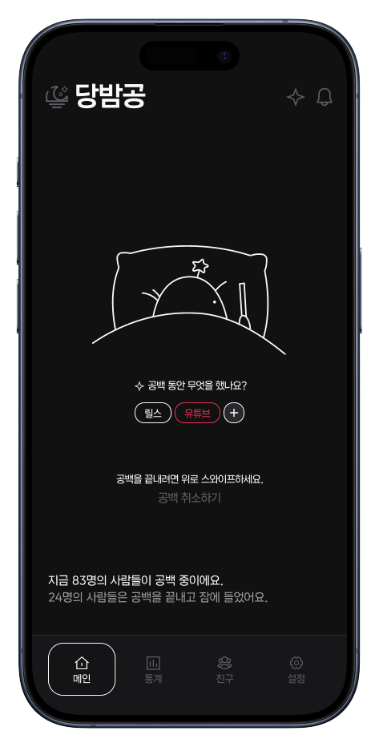
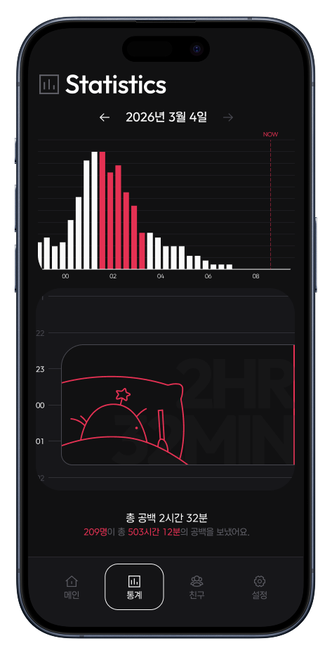
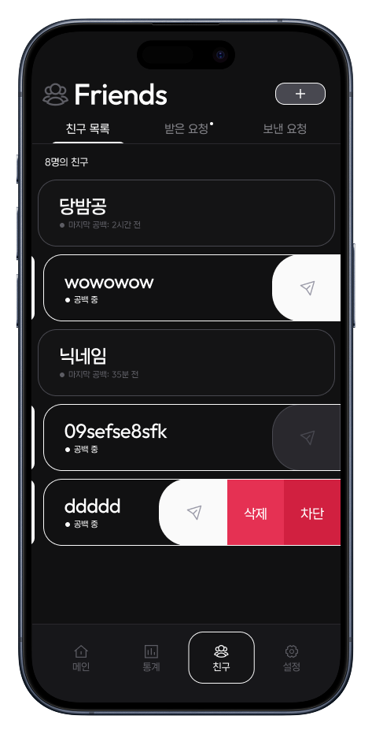
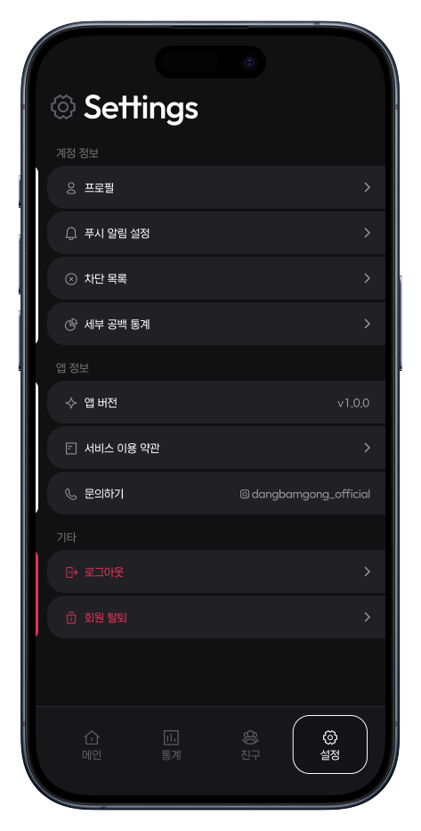
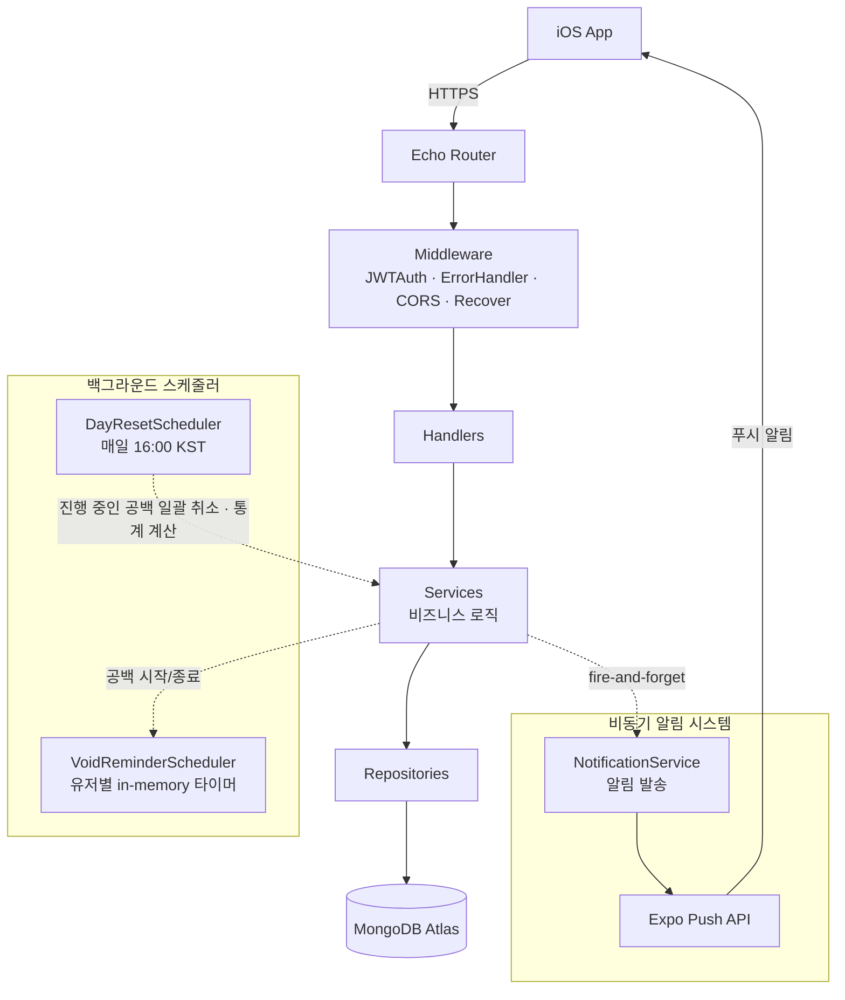

# 당밤공(Dangbamgong) Backend

> 밤의 공백을 추적하고, 같은 시간 깨어 있는 사람들의 통계를 실시간으로 확인하는 iOS 소셜 앱 당밤공의 API 서버

`당밤공`은 "**당**신은 매일 **밤** 몇 시간의 **공**백을 보냅니까?"의 줄임말로, 자기 전 침대에 누워 의미 없이 핸드폰을 보는 '밤의 공백' 시간을 추적·공유하는 소셜 앱입니다.

이 repository는 그 백엔드 API 서버이며, **AI agent를 활용해 빠르게 1인 개발**하면서 백엔드 설계 역량을 키우는 것을 목표로 한 사이드 프로젝트입니다.

### [App Store에서 다운로드](https://apps.apple.com/us/app/%EB%8B%B9%EB%B0%A4%EA%B3%B5/id6760991800)

<p align="center">
  
  
  
  
</p>

## Core Features

단순 CRUD가 아니라, **밤 시간을 다루는 도메인**과 **실시간 통계**라는 두 문제를 푸는 과정에서 나온 설계 결정들이 이 프로젝트의 핵심입니다.

### 1. 16:00 KST 기준 도메인 모델

자정이 아닌 16:00을 하루의 경계로 정의했습니다. 새벽 2시의 공백은 '어제'가 아니라 '오늘 밤'에 속해야 하기 때문입니다.

- `CalcTargetDay()` 하나로 모든 시간 경계 판정을 격리 — [internal/config/constants.go](internal/config/constants.go)
- `targetDay`(`"2006-01-02"`) 문자열을 세션·통계·캐시 전반의 파티션 키로 일관 사용

### 2. 20분 버킷 기반 실시간 통계 + 캐싱

하루를 20분 단위의 버킷 72개로 쪼개 '그 시간대에 몇 명이 공백 상태였는지'를 집계합니다.

- **시간에 따른 캐시 무효화 분기**: stale 가능성이 있는 오늘 통계는 재계산, 과거 날짜는 캐시에 없는 버킷만 계산 후 upsert
- 일별 합계는 `__summary__` 특수 버킷 키로 같은 컬렉션에 캐싱, `BulkWrite`로 N개 버킷을 한 번에 기록
- 매일 16:00 일일 리셋 시점에 전날 통계를 확정하여 과거 데이터는 재계산하지 않음
- **세부 구현**: [internal/service/stat_service.go](internal/service/stat_service.go)

### 3. Cron + in-memory 타이머 스케줄러

- **전역 스케줄러**: `robfig/cron`으로 매일 16:00 KST에 공백 일괄 취소 + 리마인더 정리 + 전날 통계 확정 - [day_reset.go](internal/service/day_reset.go)
- **개인별 타이머**: 유저가 공백을 시작하면 `time.AfterFunc`로 N시간 뒤 리마인더 알림 예약 (`sync.Mutex`로 보호되는 safe 타이머 맵) - [void_reminder.go](internal/service/void_reminder.go)
- **스케줄러 복구**: 인메모리 타이머는 서버 재시작 시 사라지므로, 부팅 시 DB에서 공백 중인 유저를 조회해 타이머를 재생성

### 4. 소셜 로그인

Google / Kakao / Apple 로그인을 외부 SDK 없이 토큰 검증 레벨에서 직접 구현했습니다.

- **Apple**: JWKS 엔드포인트에서 받은 `n`/`e`(base64url)를 직접 `rsa.PublicKey`로 파싱하고, `kid` 기반 캐싱(RWMutex + 1시간 TTL) + `iss`/`aud` 검증
- **세부 구현**: [internal/auth/social.go](internal/auth/social.go)

### 5. 비동기 Fire-and-Forget 알림

푸시 알림 발송을 HTTP 요청 생명주기에서 분리했습니다.

- 별도 goroutine + background context + panic recover로 dispatch
- 인터페이스 시그니처에서 `ctx`/`error`를 제거해 요청과 분리된 비동기 작업이라는 의도를 강제
- **세부 구현**: [notification_service.go](internal/service/notification_service.go)

> Mock 데이터 생성: 개발 환경에서 데이터가 없어 통계 화면이 비어 보이지 않도록, 시드 유저 + backfill로 가짜 공백 세션을 생성하는 기능을 별도로 두었습니다 ([fake_data.go](internal/service/fake_data.go), production에서는 비활성화).

## Tech Stack

| 분류          | 기술                                           |
| ------------- | ---------------------------------------------- |
| Language      | Go 1.26                                        |
| Framework     | Echo v4                                        |
| Database      | MongoDB (Atlas)                                |
| Auth          | JWT + Social Login (Google / Kakao / Apple)    |
| Scheduler     | robfig/cron + `time.AfterFunc`                 |
| Documentation | Swagger (swaggo)                               |
| Infra         | Docker + GitHub Actions - GHCR - AWS Lightsail |

## Architecture

**Handler - Service - Repository - MongoDB** 의 layered architecture. 모든 의존성은 인터페이스 기반으로 생성자를 통해 주입하며 [server.go](internal/server/server.go)에서 조립합니다.



### 디렉터리 구조

```
cmd/api/main.go          # 엔트리포인트 (Graceful shutdown)
internal/
  config/                # 상수 (KST, DayStartHour=16)
  database/              # MongoDB 연결 + 인덱스 보장
  domain/                # AppError 타입, ErrorCode 상수
  dto/                   # 요청/응답 DTO + 응답 헬퍼 (Success/Fail)
  model/                 # MongoDB 도큐먼트 모델
  handler/               # HTTP 핸들러 (Echo context 처리)
  service/               # 비즈니스 로직 + 스케줄러
  repository/            # MongoDB 데이터 접근
  middleware/            # JWTAuth, ErrorHandler
  auth/                  # JWT, 소셜 로그인 검증
  push/                  # Expo Push 클라이언트
docs/                    # Swagger 자동생성 문서
```

## How to start

### 사전 요구사항

- Go 1.26+
- MongoDB (로컬 Docker 또는 Atlas)

### 로컬 실행

```bash
# 1. 환경변수 설정
cp .env.example .env

# 2. 로컬 MongoDB 컨테이너 실행
make docker-run

# 3. 서버 실행
make run               # go run cmd/api/main.go

# 4. 빌드
make build             # go build -o main cmd/api/main.go
```

Swagger 문서는 서버 실행 후 `http://localhost:8000/swagger/index.html` 에서 확인할 수 있습니다.

### 환경변수

| 변수                                            | 설명                                                                                   |
| ----------------------------------------------- | -------------------------------------------------------------------------------------- |
| `PORT`                                          | 서버 포트 (기본 8000)                                                                  |
| `APP_ENV`                                       | 환경 (`development` / `production`) — production에서는 테스트/시드 엔드포인트 비활성화 |
| `DB_URI`                                        | MongoDB 연결 URI                                                                       |
| `DB_NAME`                                       | DB 이름 (기본 `dangbamgong`)                                                           |
| `JWT_SECRET`                                    | JWT 서명 키 (**필수**)                                                                 |
| `GOOGLE_WEB_CLIENT_ID` / `GOOGLE_IOS_CLIENT_ID` | Google OAuth Client ID                                                                 |
| `KAKAO_ADMIN_KEY`                               | Kakao REST API Key                                                                     |
| `APPLE_TOPIC`                                   | Apple Client ID (id_token `aud` 검증용)                                                |
| `EXPO_ACCESS_TOKEN`                             | Expo Push Access token (선택)                                                          |

## API Spec

모든 응답은 일관된 envelope 형식을 따릅니다.

```jsonc
{ "success": true, "data": { ... } } // success
{ "success": false, "code": "ERROR_CODE" } // fail
```

`/api/v1` 하위 주요 엔드포인트:

| 그룹            | 주요 엔드포인트                                              | 설명                          |
| --------------- | ------------------------------------------------------------ | ----------------------------- |
| `auth`          | `POST /auth/login`                                           | 소셜 로그인 - JWT 발급        |
| `void`          | `POST /void/start` · `/end` · `/cancel`, `GET /void/history` | 공백 세션 시작/종료/취소/이력 |
| `stats`         | `GET /stats/home` · `/daily` · `/me`                         | 실시간 · 일별 · 내 통계 조회  |
| `friends`       | `GET/POST /friends/requests`, `POST /friends/:id/nudge`      | 친구 요청/수락/콕 찌르기      |
| `activities`    | `GET/POST/PATCH/DELETE /activities`                          | 공백 활동 관리                |
| `notifications` | `GET /notifications`, `PATCH /read-all`                      | 알림 목록 조회/읽음 처리      |
| `devices`       | `PUT/DELETE /devices/token`                                  | 푸시 device token 등록/해제   |

`protected` 라우트는 `Authorization: Bearer <JWT>` 헤더가 필요합니다. 전체 명세는 Swagger 참고.

## 개발 방식에 대하여

이 프로젝트는 AI agent를 **레버리지하되 설계 판단은 직접 내리는** 워크플로우로 개발되었습니다.

[CLAUDE.md](CLAUDE.md)에 프로젝트 컨벤션과 _"모든 것을 구현하지 말고, 배울 점이 있는 부분은 TODO로 남긴다"_ 는 학습 원칙을 명시해 에이전트의 작업 방향을 정의했습니다.
</content>
